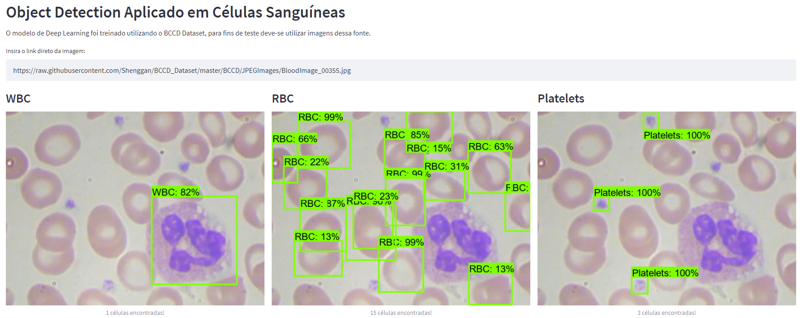

# Blood Detection

Treinamento de um modelo de Deep Learning para detecção de células sanguíneas em imagens através do uso do Object Detection do Tensorflow. O modelo permite classficar as células em células vermelhas, células brancas e plaquetas. Além disso, é capaz de realizar a contagem dessas células presentes em uma imagem. O projeto foi desenvolvido para o meu TCC e além do modelo, também foi criado um protótipo com Streamlit.

## Aplicando Deep Learning para Detecção de Células em Amostras De Sangue

O projeto foi desenvolvido para o meu TCC do curso de Sistemas de Informação do IFSC Campus Caçador. O resultado desse trabalho me trouxe uma nota 10, assim como garantiu a minha formação. O trabalho completo pode ser conferido no link abaixo.

[https://repositorio.ifsc.edu.br/handle/123456789/2501](https://repositorio.ifsc.edu.br/handle/123456789/2501)

## Preview

